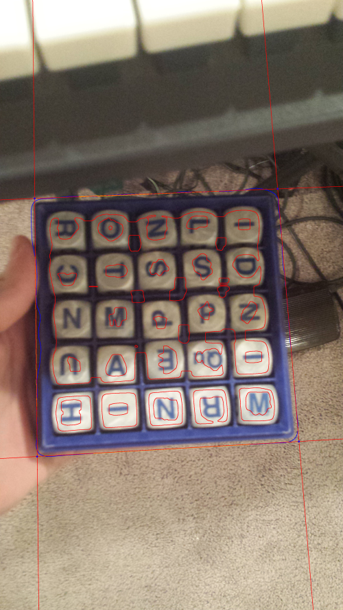

# BoggleCV
Using OpenCV and Tensorflow to identify a Boggle board in an image and decode what letters are on the board.

## Example
Here are the various stages of the computer vision and machine learning pipeline, with a sample image.

1. An HSV threshold is used to find all the blue pixels, and create a mask.
2. A contour finding algorithm from OpenCV finds the outline of large blue blob in the image.

| Image with Box Drawn | Mask to Find Blue Pixels |
| :--- | :--- |
|  |  |

3. The scipy signal processing library is used on the points in the outline to find corners
4. The box is cut out from the original image and warped to become a square.

| Corner Finding | Warped Image |
| :--- | :--- |
|  |  |

5. Next, the individual letters must be found. A sum of all the pixels in each row is taken, and the dips in brightness are found.
6. The same is repeated for the columns.
7. The positions of the rows and columns are used to cut out each letter from the image, and the letters are resized to 30x30 for easier use in machine learning.

| Row/Column Sum | Letters Cut Out |
| :--- | :--- |
|  |  |

8. This entire process is repeated over many images (and videos) to create a dataset of thousands of boggle letter images.
9. The images are labelled by hand. For videos, this is much easier since you only have to label it once for the whole video.
10. A Tensorflow model is trained on the dataset and exported to a file.

Note: steps 8-10 only have to be done one time to set up the pipeline.

11. Finally, the trained model is used to identify the letters in a new image. (See the output below.)

Right now, the model has about 88% accuracy on images it has never seen before. This is a pretty good start, but I am planning to improve it by deploying this to my site where people can play boggle, and create a system for uploading images and correcting any mistakes that the model makes. Then I will take this new data and re-train the model to achieve higher accuracy.

